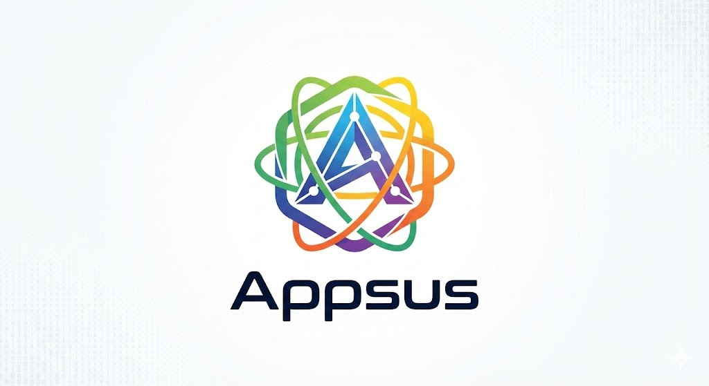

# Appsus

A modern, responsive productivity suite built with React. Appsus combines an email client with a clean, intuitive interface inspired by Google's design language.

🔗 **[Live Demo](https://aviad-benhamo.github.io/Appsus/)**



## ✨ Features

### 📧 Email App
- **Full email management** - Compose, read, star, and delete emails
- **Smart folders** - Inbox, Sent, Drafts, Starred, and Trash
- **Search functionality** - Quick search through your emails
- **Sorting options** - Sort by date or title
- **Draft auto-save** - Never lose your work
- **Unread count badges** - Stay on top of new messages
- **Gmail-inspired design** - Familiar and intuitive interface

### 📱 Responsive Design
- **Mobile-first approach** - Optimized for all screen sizes
- **Collapsible sidebar** - Slide-out navigation on mobile
- **Touch-friendly** - Large tap targets for mobile users
- **Fullscreen compose** - Distraction-free writing on mobile

## 🛠️ Technologies

- **React** - Component-based UI library
- **React Router** - Client-side routing (SPA)
- **React Hooks** - useState, useEffect, custom hooks
- **CSS3** - Modern styling with CSS variables & Flexbox/Grid
- **Local Storage** - Persistent data storage
- **Font Awesome** - Icon library

## 🚀 Getting Started

### Prerequisites
- A modern web browser
- A local server (e.g., Live Server VS Code extension)

### Installation

1. Clone the repository:
```bash
git clone https://github.com/aviad-benhamo/Appsus.git
```

2. Navigate to the project directory:
```bash
cd Appsus
```

3. Open with a local server:
   - Using VS Code: Right-click `index.html` → "Open with Live Server"
   - Or use any static file server of your choice

## 📁 Project Structure

```
Appsus/
├── apps/
│   └── mail/
│       ├── cmps/           # Mail components
│       ├── pages/          # Mail pages
│       └── services/       # Mail services
├── assets/
│   ├── css/               # Stylesheets
│   │   ├── apps/          # App-specific styles
│   │   ├── basics/        # Base styles
│   │   ├── cmps/          # Component styles
│   │   ├── pages/         # Page styles
│   │   └── setup/         # CSS variables
│   ├── fonts/
│   └── img/
├── cmps/                  # Shared components
├── lib/                   # External libraries
├── pages/                 # Main pages
├── services/              # Shared services
├── app.js                 # Entry point
├── index.html
└── RootCmp.jsx           # Root component
```

## 🎨 Design Highlights

- **Clean UI** - Minimalist design with focus on usability
- **Consistent theming** - CSS custom properties for easy customization
- **Smooth animations** - Subtle transitions enhance the experience
- **Accessibility** - Semantic HTML and proper contrast ratios

## 👨‍💻 Author

**Aviad Ben Hamo**
- GitHub: [@aviad-benhamo](https://github.com/aviad-benhamo)
- LinkedIn: [Aviad Ben Hamo](https://www.linkedin.com/in/aviad-ben-hamo-176a18122/)

## 📄 License

This project is open source and available under the [MIT License](LICENSE).

---

⭐ If you found this project useful, please consider giving it a star!
